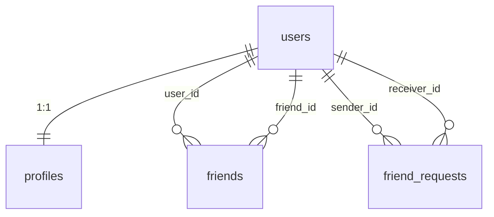
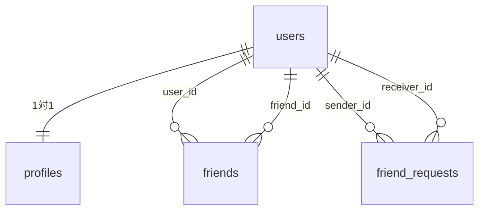

_This project has been created as part of the 42 curriculum by shinji-japaaaan, alex216, tenpapa1988, fceragio_

# ft_transcendence (English)

42 Tokyo — Full-stack web application (Pong game + user management + chat)

---

## Team Information

| Handle   | GitHub                                                 |
| -------- | ------------------------------------------------------ |
| sishizaw | [@shinji-japaaaan](https://github.com/shinji-japaaaan) |
| alex     | [@alex216](https://github.com/alex216)                 |
| tenpapa  | [@tenpapa1988](https://github.com/tenpapa1988)         |
| Federico | [@fceragio](https://github.com/fceragio)               |

---

## Roles

| Member      | Project Role         | Area of responsibility                                                    |
| ----------- | -------------------- | ------------------------------------------------------------------------- |
| sishizaw    | Project Manager (PM) | DB design & migrations, backend API (Profile / Stats / GDPR), security    |
| alex (yliu) | Product Owner (PO)   | Game frontend & online mode, infrastructure & CI, integration tests       |
| tenpapa     | Developer            | Frontend (UI/UX, responsive design, stats pages, i18n)                    |
| Federico    | Tech Lead            | Game backend foundation, AI & reconnection logic, shared type definitions |

---

## Project Management

- **Task tracking**: GitHub Issues and Milestones (Milestones 1–14)
- **Code review**: Pull Requests on GitHub (all merges require review)
- **Communication**: Discord (daily sync, review requests)
- **Branch strategy**: Feature branches per milestone/feature, merged into `main` via PR

---

## Features

### Authentication & Account

- User registration and login with username / password _(sishizaw, alex)_
- 42 OAuth login (via 42 API) _(sishizaw, alex)_
- JWT authentication (HTTP Only Cookie) _(sishizaw, alex)_
- Two-factor authentication (2FA) — Google Authenticator compatible _(sishizaw, alex)_
- CSRF protection (Double Submit Cookie) _(sishizaw)_

### User & Profile

- Edit display name, bio, and avatar image _(sishizaw, alex)_
- Friend requests / approval / list _(sishizaw, alex)_
- Online status badge in friend list (real-time WebSocket updates) _(alex, sishizaw)_
- View other user's profile in a modal (from friend list and DM header) _(alex)_

### Pong Game

- AI match mode _(Federico, alex)_
- Online match mode (WebSocket real-time) _(Federico, alex)_
- Confirmation dialog when switching modes mid-game _(alex)_
- Reconnection handling (auto-detection after opponent disconnects) _(Federico)_
- Score saving and match history _(sishizaw, alex)_

### Statistics & Rankings

- Dashboard showing win rate / win-loss count / total matches _(sishizaw, tenpapa)_
- Recent match history list _(sishizaw, tenpapa)_
- Leaderboard (ranking of all users) _(sishizaw, tenpapa)_

### Chat

- Global chat room (open to all users) _(sishizaw, alex)_
- Real-time messages via WebSocket _(sishizaw, alex)_

### GDPR

- Personal data export (JSON download) _(sishizaw, tenpapa)_
- Account deletion (removes all associated data) _(sishizaw, tenpapa)_
- Email notification sent on data export / account deletion _(sishizaw)_

### Security / WAF

- ModSecurity WAF (OWASP Core Rule Set) integrated into Nginx _(sishizaw)_
- Tuning rules to prevent false positives (PUT / PATCH / DELETE methods) _(sishizaw)_

### Other

- Multilingual UI (Japanese / English / French) _(alex, tenpapa)_
- Responsive design (PC / tablet / mobile) _(tenpapa)_
- HTTPS (Nginx + self-signed certificate) _(sishizaw)_

---

## Technical Stack

| Layer             | Technology                                   | Notes                                |
| ----------------- | -------------------------------------------- | ------------------------------------ |
| Frontend          | React 18 + TypeScript + Vite                 | SPA architecture                     |
| Backend           | NestJS (TypeScript)                          | Modular design, Guard / Pipe pattern |
| Database          | PostgreSQL 15                                | Schema managed by TypeORM            |
| Real-time         | WebSocket (Socket.IO)                        | Game and chat                        |
| Auth              | JWT (Passport.js) + Google Authenticator 2FA | Cookie-based                         |
| Reverse proxy     | Nginx                                        | HTTPS termination and routing        |
| Secret management | HashiCorp Vault                              | Manages credentials and env secrets  |
| Containerization  | Docker + Docker Compose                      | All services managed together        |

---

## Modules

Major = 2 points, Minor = 1 point

> **Note**: SSL/TLS, HTTPS, CSRF and XSS protections are **mandatory requirements** (Chapter III.3), not scoreable modules.

| #         | Module                                                                | Type  | Points | Contributor(s)           | PDF Ref |
| --------- | --------------------------------------------------------------------- | ----- | ------ | ------------------------ | ------- |
| 1         | Frontend + Backend Framework (React + NestJS)                         | Major | 2      | tenpapa, alex            | IV.1    |
| 2         | WebSocket Real-time (chat + game)                                     | Major | 2      | Federico, alex           | IV.1    |
| 3         | User Interaction (chat + profile + friends)                           | Major | 2      | Federico, alex, sishizaw | IV.1    |
| 4         | ORM (TypeORM)                                                         | Minor | 1      | sishizaw                 | IV.1    |
| 5         | Game Statistics and Match History                                     | Minor | 1      | sishizaw, tenpapa        | IV.3    |
| 6         | Remote Authentication (42 OAuth)                                      | Minor | 1      | alex                     | IV.3    |
| 7         | Two-Factor Authentication (2FA)                                       | Minor | 1      | sishizaw                 | IV.3    |
| 8         | AI Opponent (custom backend implementation with ball prediction)      | Major | 2      | Federico, alex           | IV.4    |
| 9         | Web-based Game (Pong)                                                 | Major | 2      | Federico, alex           | IV.6    |
| 10        | Remote Players (WebSocket online match)                               | Major | 2      | Federico, alex           | IV.6    |
| 11        | Multiple Language Support (JA / EN / FR)                              | Minor | 1      | tenpapa                  | IV.2    |
| 12        | GDPR Compliance (data export, account deletion, email notification)   | Minor | 1      | sishizaw, tenpapa        | IV.8    |
| 13        | Browser Compatibility (Chrome / Firefox)                              | Minor | 1      | tenpapa                  | IV.2    |
| 14        | Standard User Management (profile, avatar, online status, friends)    | Major | 2      | alex, sishizaw           | IV.3    |
| 15        | WAF + Secret Management (ModSecurity + OWASP CRS / HashiCorp Vault)   | Major | 2      | sishizaw                 | IV.5    |
| **Total** |                                                                       |       | **23** |                          |         |

### Module Selection Rationale

| Module                          | Why we chose it                                                                              |
| ------------------------------- | -------------------------------------------------------------------------------------------- |
| Framework (React + NestJS)      | TypeScript end-to-end; NestJS Guard/Pipe/Decorator pattern keeps auth logic decoupled        |
| WebSocket (chat + game)         | Real-time bi-directional communication is the core requirement for both game and chat        |
| User Interaction (chat+profile) | Profile, friends, and chat are fundamental social features required by the subject           |
| ORM (TypeORM)                   | Type-safe queries and migration CLI reduce schema drift risk in a team environment           |
| Game Stats & Match History      | Provides meaningful user progression data without significant extra infrastructure           |
| Remote Auth (42 OAuth)          | Required by the 42 subject; leverages the school's own identity provider                     |
| 2FA                             | Required security layer; integrates with existing JWT auth without additional services       |
| AI Opponent                     | Enables single-player testing and demo without requiring two connected users simultaneously  |
| Web Game (Pong)                 | Core mandatory module of the ft_transcendence subject                                        |
| Remote Players                  | Fulfills the primary multiplayer goal via the existing WebSocket infrastructure              |
| Multiple Language Support       | French translation required for 42 Paris compatibility; Japanese/English for our team        |
| GDPR Compliance                 | Mandatory EU data regulation; data export and account deletion are low-overhead to implement |
| Browser Compatibility           | Ensures evaluators on any campus machine (Chrome/Firefox) can test without issues            |
| Standard User Management        | Profile, avatar, online status, and friend list together satisfy all IV.3 Major requirements |
| WAF + Vault (IV.5)              | ModSecurity/OWASP CRS blocks common attacks; Vault already manages all secrets — together they satisfy the single IV.5 Major requirement |

### Backend Module Structure (NestJS)

| Module          | Path                   | Description                                 |
| --------------- | ---------------------- | ------------------------------------------- |
| `AuthModule`    | `backend/src/auth/`    | JWT issue/verification, 2FA, 42 OAuth, CSRF |
| `UserModule`    | `backend/src/user/`    | User entity management                      |
| `ProfileModule` | `backend/src/profile/` | Profile CRUD (display name, avatar, etc.)   |
| `FriendModule`  | `backend/src/friend/`  | Friend requests, approval, list             |
| `ChatModule`    | `backend/src/chat/`    | WebSocket gateway + message persistence     |
| `GameModule`    | `backend/src/game/`    | Pong game logic, AI, match history          |
| `StatsModule`   | `backend/src/stats/`   | Win rate and match count aggregation API    |
| `GdprModule`    | `backend/src/gdpr/`    | Data export and account deletion            |

**Why NestJS**: TypeScript-native with strong type safety. Authentication checks (Guard), input validation (Pipe), and routing (Decorator) can each be defined independently from business logic modules.

### Frontend Structure (React + Vite)

| Directory                  | Contents                                                   |
| -------------------------- | ---------------------------------------------------------- |
| `frontend/src/components/` | Page components (Game / Chat / Profile, etc.)              |
| `frontend/src/hooks/`      | Custom hooks (CSRF token fetch, GDPR actions, stats fetch) |
| `frontend/src/services/`   | WebSocket clients (game and chat)                          |
| `frontend/src/i18n/`       | Multilingual translation tables                            |

### Infrastructure

| File                           | Role                                                               |
| ------------------------------ | ------------------------------------------------------------------ |
| `docker-compose.yml`           | Defines 5 services (nginx / vault / postgres / backend / frontend) |
| `nginx/nginx.conf`             | HTTPS termination, `/api` → backend reverse proxy, WAF activation  |
| `nginx/modsecurity-tuning.conf`| ModSecurity false-positive exclusions for our app                  |
| `Makefile`                     | Aggregates dev commands: `make setup`, `make build`, etc.          |
| `backend/src/migrations/`      | TypeORM migration files                                            |
| `shared/`                      | Type definitions and constants shared between frontend and backend |

---

## Database Schema

See [`docs/er-diagram.md`](./docs/er-diagram.md) for the full ER diagram and constraints.

| Table             | Description                                                                              |
| ----------------- | ---------------------------------------------------------------------------------------- |
| `users`           | Auth info (username, password hash, 42 ID, 2FA settings, email, is_online, last_seen_at) |
| `profiles`        | Profile info (displayName, bio, avatarUrl) — 1:1 with users                             |
| `friends`         | Confirmed friend relationships                                                           |
| `friend_requests` | Friend requests (pending / accepted / rejected)                                          |
| `chat`            | Chat messages (per roomId)                                                               |
| `match_history`   | Match results (winnerUserId, loserUserId, scores)                                        |



---

## Individual Contributions

### sishizaw

- **DB design**: ER diagram, TypeORM entity definitions, migration setup (`backend/src/migrations/`); added `email`, `is_online`, `last_seen_at` columns to `users`
- **ProfileModule**: Profile CRUD, avatar upload, XSS input validation
- **StatsModule / GDPR backend**: Win-rate aggregation API, match history API, data export / account deletion
- **GDPR email notification**: Created `MailModule` / `mail.service.ts`; sends confirmation email on data export and account deletion (Ethereal fallback when MAIL_HOST is unset)
- **Online status backend**: Added `is_online` / `last_seen_at` to `users` entity and migration; implemented `UserStatusService` (setOnline / setOffline); refactored backend responsibility
- **WAF / ModSecurity**: Integrated ModSecurity + OWASP CRS into Nginx (`nginx/Dockerfile`, `nginx/modsecurity-tuning.conf`); fixed false positives for PUT / PATCH / DELETE; added Nginx `/healthz` endpoint
- **Vault**: Version pin and SSL certificate permission fix; migration consolidation
- **WebSocket auth**: JWT-based socket connection authentication fix
- **Security**: CodeQL Path Injection fix, 2FA bug fixes (401 error, console noise), CSRF token re-fetch fix, Content-Security-Policy introduction

### alex (yliu)

- **Game frontend**: Updated `GamePage` for new protocol (forfeit, reconnect, mode switch with `ConfirmDialog`)
- **Online mode**: Updated `OnlinePage`, added i18n keys for 3 languages
- **Online status frontend**: Real-time WebSocket broadcast of status changes; DB-centralized status with login/logout integration; online badge in friend list
- **View other user profile**: Modal display from friend list and DM header
- **Infrastructure**: Docker Compose, Nginx, HashiCorp Vault integration, SSL certificate setup; dev-environment `/@fs/` 403 fix
- **CI / Quality**: Integration test suite (`test/`), TypeORM migration auto-run, dependabot management
- **Bootstrap migration**: Migrated all components to Bootstrap CSS framework

### tenpapa

- **Stats Dashboard**: Frontend implementation of win rate / win-loss / match history (`StatsDashboard.tsx`)
- **GDPR settings**: Frontend implementation of data export / account deletion (`GdprSettings.tsx`)
- **Stats page connection**: Connected `HistoryPage` and `LeaderboardPage` to backend API (including opponent name display fix)
- **Home page**: Created home UI and i18n translation tables (Japanese / English / French)
- **Responsive design**: CSS fixes for all devices (mobile / tablet / PC)

### Federico

- **Game backend foundation**: Built WebSocket gateway, game logic, and AI mode from scratch (`game.gateway.ts` / `game.service.ts`)
- **AI difficulty**: Tuned AI to behave more human-like; unified difficulty/delay relationship
- **Reconnection & disconnect handling**: Backend auto-detection of reconnect, match invalidation on both-player disconnect, forfeit handling after opponent disconnect
- **Game message fixes (PR #93)**: Correct game-over and message when reconnected player wins on grace-time expiry; "waiting for opponent reconnect" message shown to reconnected player too; unified cancel message for both players
- **Shared design**: Extracted common constants (`GRACE_TIME`, etc.) and GameState DTOs into `shared/`

---

## Setup Instructions

### Prerequisites

- Docker and Docker Compose must be installed
- Node.js (required for husky / lint-staged setup)

### For 42 OAuth (optional)

Register an application on 42 Intra and set the Redirect URI to `https://localhost/api/auth/42/callback`.

### Steps

```bash
# 1. Clone the repository
git clone git@github.com:alex216/ft_transcendence.git
cd ft_transcendence

# 2. First-time setup
#    - Generate .env (auto-generates CSRF_SECRET / JWT_SECRET)
#    - Generate SSL certificate (nginx/ssl/)
#    - npm install (enables husky / lint-staged)
make setup

# 3. Edit .env if using 42 OAuth
#    Set FORTY_TWO_CLIENT_ID and FORTY_TWO_CLIENT_SECRET
nano .env

# 4. Build and start containers
make build

# 5. Open in browser: https://localhost
#    Accept the self-signed certificate warning to proceed
```

### Commands

| Command          | Description                                             |
| ---------------- | ------------------------------------------------------- |
| `make setup`     | First-time setup (generate .env, SSL cert, npm install) |
| `make build`     | Rebuild and start containers                            |
| `make up`        | Start containers (no rebuild)                           |
| `make down`      | Stop containers                                         |
| `make logs`      | Stream logs from all services                           |
| `make reinstall` | Reinstall node_modules and restart                      |
| `make fclean`    | Remove all containers and volumes                       |
| `make re`        | fclean + build                                          |

### Access

After startup, open `https://localhost` in your browser.

> The browser will show a certificate warning. Click "Advanced" → "Proceed to localhost (unsafe)" to continue.

---

## API Reference

### Authentication

| Endpoint            | Method | Description               |
| ------------------- | ------ | ------------------------- |
| `/auth/csrf-token`  | GET    | Get CSRF token            |
| `/auth/register`    | POST   | Register a new user       |
| `/auth/login`       | POST   | Login (issues JWT cookie) |
| `/auth/logout`      | POST   | Logout (clears cookie)    |
| `/auth/me`          | GET    | Get current user info     |
| `/auth/42`          | GET    | Start 42 OAuth login      |
| `/auth/42/callback` | GET    | 42 OAuth callback         |
| `/auth/2fa/setup`   | POST   | 2FA setup (get QR code)   |
| `/auth/2fa/enable`  | POST   | Enable 2FA                |
| `/auth/2fa/verify`  | POST   | Verify 2FA code           |
| `/auth/2fa/disable` | POST   | Disable 2FA               |

### Profile, Friends & Stats

| Endpoint                     | Method | Description                       |
| ---------------------------- | ------ | --------------------------------- |
| `/profile/me`                | GET    | Get own profile                   |
| `/profile/me`                | PUT    | Update own profile                |
| `/profile/:id`               | GET    | Get another user's profile        |
| `/profile/avatar`            | POST   | Upload avatar image               |
| `/profile/avatar`            | DELETE | Delete avatar image               |
| `/friends`                   | GET    | Friend list                       |
| `/friends/requests`          | GET    | Friend request list               |
| `/friends/request`           | POST   | Send friend request               |
| `/friends/accept/:requestId` | POST   | Accept friend request             |
| `/friends/reject/:requestId` | POST   | Reject friend request             |
| `/friends/:friendId`         | DELETE | Remove friend                     |
| `/friends/status/:userId`    | GET    | Check friend status               |
| `/stats/me`                  | GET    | Own stats (win rate, match count) |
| `/stats/me/match-history`    | GET    | Own match history                 |
| `/stats/leaderboard`         | GET    | Leaderboard                       |

### GDPR

| Endpoint        | Method | Description                            |
| --------------- | ------ | -------------------------------------- |
| `/gdpr/export`  | GET    | Export personal data as JSON           |
| `/gdpr/account` | DELETE | Delete account and all associated data |

---

## Environment Variables

| Variable                  | Description                                             | Default                                  |
| ------------------------- | ------------------------------------------------------- | ---------------------------------------- |
| `POSTGRES_USER`           | DB username                                             | `transcendence`                          |
| `POSTGRES_PASSWORD`       | DB password                                             | —                                        |
| `POSTGRES_DB`             | DB name                                                 | `transcendence_db`                       |
| `POSTGRES_HOST`           | DB host (inside Docker)                                 | `postgres`                               |
| `POSTGRES_PORT`           | DB port                                                 | `5432`                                   |
| `CSRF_SECRET`             | CSRF token signing key (auto-generated by `make setup`) | —                                        |
| `JWT_SECRET`              | JWT signing key (auto-generated by `make setup`)        | —                                        |
| `BACKEND_PORT`            | Backend port                                            | `3000`                                   |
| `FRONTEND_PORT`           | Frontend port                                           | `3001`                                   |
| `NODE_ENV`                | Runtime environment                                     | `development`                            |
| `FRONTEND_URL`            | Frontend URL (for CORS)                                 | `https://localhost`                      |
| `VITE_API_URL`            | Backend API URL (for frontend)                          | `https://localhost/api`                  |
| `FORTY_TWO_CLIENT_ID`     | 42 OAuth client ID                                      | —                                        |
| `FORTY_TWO_CLIENT_SECRET` | 42 OAuth client secret                                  | —                                        |
| `FORTY_TWO_CALLBACK_URL`  | 42 OAuth callback URL                                   | `https://localhost/api/auth/42/callback` |
| `VAULT_ADDR`              | Vault address                                           | `http://vault:8200`                      |
| `VAULT_TOKEN`             | Vault token                                             | —                                        |
| `MAIL_HOST`               | SMTP server host (leave blank to use Ethereal test)     | —                                        |
| `MAIL_PORT`               | SMTP server port                                        | `587`                                    |
| `MAIL_USER`               | SMTP username                                           | —                                        |
| `MAIL_PASS`               | SMTP password                                           | —                                        |

---

## Troubleshooting

### Browser shows "Your connection is not private"

Expected behavior — a self-signed certificate is used for development.
Click "Advanced" → "Proceed to localhost (unsafe)" to continue.

### Containers fail to start

```bash
make logs
docker-compose ps
```

### Database connection error

```bash
docker-compose logs postgres
docker-compose down -v
make build
```

### npm install error

```bash
make reinstall
```

### Port already in use

```bash
lsof -i :443   # Nginx
lsof -i :3000  # Backend
lsof -i :3001  # Frontend
lsof -i :5432  # PostgreSQL
```

---

## Security

| Measure                  | Implementation                                                  |
| ------------------------ | --------------------------------------------------------------- |
| XSS protection           | JWT in HTTP Only Cookie; input sanitization via class-validator |
| CSRF protection          | Double Submit Cookie pattern                                    |
| SQL injection protection | TypeORM parameter binding                                       |
| Password protection      | Hashed with bcrypt                                              |
| HTTPS                    | TLS termination via Nginx                                       |
| Two-factor auth          | Google Authenticator compatible (TOTP)                          |
| Input validation         | NestJS DTO + class-validator                                    |
| WAF                      | ModSecurity + OWASP Core Rule Set integrated into Nginx (IV.5)  |
| Secret management        | HashiCorp Vault manages all credentials and env secrets (IV.5)  |

---

## Resources

### References

- [NestJS Documentation](https://docs.nestjs.com/)
- [React Documentation](https://react.dev/)
- [TypeORM Documentation](https://typeorm.io/)
- [Socket.IO Documentation](https://socket.io/docs/)
- [Passport.js JWT Strategy](https://www.passportjs.org/packages/passport-jwt/)
- [HashiCorp Vault Documentation](https://developer.hashicorp.com/vault/docs)
- [42 API Documentation](https://api.intra.42.fr/apidoc)

### Use of AI

Claude (Anthropic) was used as a development assistant throughout this project:

- **Code writing**: Generating code for backend APIs, security fixes, frontend components, etc.
- **Code review**: Reviewing pull requests and identifying bugs (e.g., security vulnerabilities flagged by CodeQL)
- **Documentation**: Generating and structuring README and ER diagram documentation
- **Debugging**: Diagnosing WebSocket reconnection logic and 2FA edge cases
- **Architecture guidance**: Discussing module boundaries and NestJS design patterns

All AI-generated code was reviewed and understood by team members before being adopted.

---

---

> 以下は日本語版（参考用）です。
> _このプロジェクトは 42 カリキュラムの一環として shinji-japaaaan, alex216, tenpapa1988, fceragio によって作成されました。_

# ft_transcendence

42 Tokyo — フルスタック Web アプリケーション（Pong ゲーム + ユーザー管理 + チャット）

---

## チーム情報

| ハンドル | GitHub                                                 |
| -------- | ------------------------------------------------------ |
| sishizaw | [@shinji-japaaaan](https://github.com/shinji-japaaaan) |
| alex     | [@alex216](https://github.com/alex216)                 |
| tenpapa  | [@tenpapa1988](https://github.com/tenpapa1988)         |
| Federico | [@fceragio](https://github.com/fceragio)               |

---

## 役割分担

| メンバー    | 役職                     | 担当領域                                                                            |
| ----------- | ------------------------ | ----------------------------------------------------------------------------------- |
| sishizaw    | プロジェクトマネージャー | DB 設計・マイグレーション、バックエンド API（Profile / Stats / GDPR）、セキュリティ |
| alex (yliu) | プロダクトオーナー       | ゲームフロントエンド・オンラインモード、インフラ・CI、統合テスト                    |
| tenpapa     | デベロッパー             | フロントエンド全般（UI/UX・レスポンシブ・統計ページ・多言語化）                     |
| Federico    | テックリード             | ゲームバックエンド基盤、AI・再接続ロジック、shared 型定義                           |

---

## プロジェクト管理

- **タスク管理**: GitHub Issues + Milestones（マイルストーン 1〜14）
- **コードレビュー**: GitHub Pull Request（全マージにレビュー必須）
- **コミュニケーション**: Discord（日次同期・レビュー依頼）
- **ブランチ戦略**: マイルストーン/機能ごとにフィーチャーブランチを切り、PR 経由で `main` にマージ

---

## 機能リスト

### 認証・アカウント

- ユーザー名 / パスワードによる新規登録・ログイン _(sishizaw, alex)_
- 42 OAuth 連携ログイン（42 API 経由） _(sishizaw, alex)_
- JWT 認証（HTTP Only Cookie） _(sishizaw, alex)_
- 二要素認証（2FA）— Google Authenticator 対応 _(sishizaw, alex)_
- CSRF 保護（Double Submit Cookie） _(sishizaw)_

### ユーザー・プロフィール

- 表示名・自己紹介・アバター画像の編集 _(sishizaw, alex)_
- フレンド申請 / 承認 / 一覧表示 _(sishizaw, alex)_
- フレンドリストへのオンラインステータスバッジ表示（WebSocket リアルタイム更新） _(alex, sishizaw)_
- フレンド一覧・DM ヘッダーから他ユーザーのプロフィールをモーダル表示 _(alex)_

### Pong ゲーム

- AI 対戦モード _(Federico, alex)_
- オンライン対戦モード（WebSocket リアルタイム通信） _(Federico, alex)_
- ゲーム中のモード切替時確認ダイアログ _(alex)_
- 再接続処理（相手切断後の自動判定） _(Federico)_
- スコア保存・試合履歴 _(sishizaw, alex)_

### 統計・ランキング

- 勝率 / 勝敗数 / 試合数のダッシュボード _(sishizaw, tenpapa)_
- 直近の試合履歴一覧 _(sishizaw, tenpapa)_
- リーダーボード（全ユーザーランキング） _(sishizaw, tenpapa)_

### チャット

- グローバルチャット（全員参加のルーム） _(sishizaw, alex)_
- WebSocket によるリアルタイムメッセージ _(sishizaw, alex)_

### GDPR 対応

- 個人データのエクスポート（JSON ダウンロード） _(sishizaw, tenpapa)_
- アカウント削除（全関連データの消去） _(sishizaw, tenpapa)_
- データエクスポート・アカウント削除時のメール通知送信 _(sishizaw)_

### セキュリティ / WAF

- ModSecurity WAF（OWASP Core Rule Set）を Nginx に統合 _(sishizaw)_
- PUT / PATCH / DELETE メソッドの誤検知（403）を除外ルールで対処 _(sishizaw)_

### その他

- 多言語対応 UI（日本語 / 英語 / フランス語） _(alex, tenpapa)_
- レスポンシブデザイン（PC / タブレット / モバイル） _(tenpapa)_
- HTTPS 通信（Nginx + 自己署名証明書） _(sishizaw)_

---

## 技術スタック

| 層               | 技術                                              | 補足                                  |
| ---------------- | ------------------------------------------------- | ------------------------------------- |
| フロントエンド   | React 18 + TypeScript + Vite                      | SPA 構成                              |
| バックエンド     | NestJS (TypeScript)                               | モジュール分割、Guard / Pipe パターン |
| データベース     | PostgreSQL 15                                     | TypeORM によるスキーマ管理            |
| リアルタイム通信 | WebSocket（Socket.IO）                            | ゲーム・チャット                      |
| 認証             | JWT (Passport.js) + Google Authenticator 対応 2FA | Cookie ベース                         |
| リバースプロキシ | Nginx                                             | HTTPS 終端・ルーティング              |
| 秘密情報管理     | HashiCorp Vault                                   | クレデンシャル・環境変数を一元管理    |
| コンテナ         | Docker + Docker Compose                           | 全サービス一括管理                    |

---

## モジュール一覧（42 評価項目）

Major = 2 ポイント、Minor = 1 ポイント

> **注意**: SSL/TLS・HTTPS・CSRF/XSS 保護は Chapter III.3 の**必須要件**のため、モジュールポイントには含みません。

| #        | モジュール                                                                         | 種別  | ポイント | 担当                     | PDF 参照 |
| -------- | ---------------------------------------------------------------------------------- | ----- | -------- | ------------------------ | -------- |
| 1        | フロント + バックエンドフレームワーク（React + NestJS）                            | Major | 2        | tenpapa, alex            | IV.1     |
| 2        | WebSocket リアルタイム通信（チャット + ゲーム）                                    | Major | 2        | Federico, alex           | IV.1     |
| 3        | ユーザーインタラクション（チャット + プロフィール + フレンド）                     | Major | 2        | Federico, alex, sishizaw | IV.1     |
| 4        | ORM（TypeORM）                                                                     | Minor | 1        | sishizaw                 | IV.1     |
| 5        | ゲーム統計・マッチ履歴                                                             | Minor | 1        | sishizaw, tenpapa        | IV.3     |
| 6        | リモート認証（42 OAuth）                                                           | Minor | 1        | alex                     | IV.3     |
| 7        | 2FA（二要素認証）                                                                  | Minor | 1        | sishizaw                 | IV.3     |
| 8        | AI 対戦相手（バックエンド自前実装・ボール軌道予測付き）                            | Major | 2        | Federico, alex           | IV.4     |
| 9        | ゲーム実装（Pong）                                                                 | Major | 2        | Federico, alex           | IV.6     |
| 10       | リモートプレイヤー（WebSocket オンライン対戦）                                     | Major | 2        | Federico, alex           | IV.6     |
| 11       | 多言語対応（日 / 英 / 仏）                                                         | Minor | 1        | tenpapa                  | IV.2     |
| 12       | GDPR 対応（データエクスポート・アカウント削除・メール通知）                         | Minor | 1        | sishizaw, tenpapa        | IV.8     |
| 13       | ブラウザ互換性（Chrome / Firefox）                                                 | Minor | 1        | tenpapa                  | IV.2     |
| 14       | 標準ユーザー管理（プロフィール・アバター・オンラインステータス・フレンド）          | Major | 2        | alex, sishizaw           | IV.3     |
| 15       | WAF + 秘密情報管理（ModSecurity + OWASP CRS / HashiCorp Vault）                    | Major | 2        | sishizaw                 | IV.5     |
| **合計** |                                                                                    |       | **23**   |                          |          |

### モジュール選定理由

| モジュール                       | 選定理由                                                                                 |
| -------------------------------- | ---------------------------------------------------------------------------------------- |
| フレームワーク（React + NestJS） | TypeScript 統一で型安全性を確保。Guard/Pipe/Decorator で認証・バリデーションを分離できる |
| WebSocket（チャット + ゲーム）   | ゲーム・チャットの双方向リアルタイム通信は課題の中核要件であるため                       |
| ユーザーインタラクション         | プロフィール・フレンド・チャットは課題で求められる基本的なソーシャル機能                 |
| ORM（TypeORM）                   | 型安全なクエリとマイグレーション CLI により、チーム開発時のスキーマずれを防止            |
| ゲーム統計・試合履歴             | 追加インフラ不要で有意義なユーザー体験を提供できる                                       |
| リモート認証（42 OAuth）         | 課題要件。42 学校のアイデンティティプロバイダーを活用                                    |
| 2FA                              | 必須セキュリティ層。既存 JWT 認証に追加サービス不要で統合可能                            |
| AI 対戦相手                      | 2 人接続不要でシングルプレイテストとデモが可能になる                                     |
| Web ゲーム（Pong）               | ft_transcendence 課題の中核必須モジュール                                                |
| リモートプレイヤー               | 既存 WebSocket 基盤を活用してマルチプレイの主目的を達成                                  |
| 多言語対応                       | 42 Paris の評価者向けにフランス語が必要。日本語・英語はチームの使用言語                  |
| GDPR 対応                        | EU データ規制への対応。データエクスポート・削除は低コストで実装可能                      |
| ブラウザ互換性                   | 評価者がどのキャンパスのマシン（Chrome/Firefox）でもテストできるように確保               |
| 標準ユーザー管理                 | プロフィール・アバター・オンラインステータス・フレンドリストで IV.3 Major の全要件を充足  |
| WAF + Vault (IV.5)              | ModSecurity/OWASP CRS で一般的な攻撃をブロック、Vault で全シークレットを管理。両方の組み合わせで IV.5 Major 1つを充足 |

### バックエンドモジュール構成（NestJS）

| モジュール      | パス                   | 説明                                      |
| --------------- | ---------------------- | ----------------------------------------- |
| `AuthModule`    | `backend/src/auth/`    | JWT 発行・検証、2FA、42 OAuth、CSRF       |
| `UserModule`    | `backend/src/user/`    | ユーザーエンティティ管理                  |
| `ProfileModule` | `backend/src/profile/` | プロフィール CRUD（表示名・アバター等）   |
| `FriendModule`  | `backend/src/friend/`  | フレンド申請・承認・一覧                  |
| `ChatModule`    | `backend/src/chat/`    | WebSocket ゲートウェイ + メッセージ永続化 |
| `GameModule`    | `backend/src/game/`    | Pong ゲームロジック・AI・試合履歴         |
| `StatsModule`   | `backend/src/stats/`   | 勝率・試合数の集計 API                    |
| `GdprModule`    | `backend/src/gdpr/`    | データエクスポート・アカウント削除        |

**NestJS を採用した理由**: TypeScript ネイティブで型安全性が高く、認証チェック（Guard）・入力バリデーション（Pipe）・ルーティング（Decorator）を各モジュールから独立して定義できるため。

### フロントエンド構成（React + Vite）

| ディレクトリ               | 内容                                                     |
| -------------------------- | -------------------------------------------------------- |
| `frontend/src/components/` | 各ページコンポーネント（Game / Chat / Profile 等）       |
| `frontend/src/hooks/`      | カスタムフック（CSRF トークン取得、GDPR 操作、統計取得） |
| `frontend/src/services/`   | WebSocket クライアント（ゲーム・チャット）               |
| `frontend/src/i18n/`       | 多言語翻訳テーブル                                       |

### インフラ

| ファイル                          | 役割                                                              |
| --------------------------------- | ----------------------------------------------------------------- |
| `docker-compose.yml`              | 5 サービス（nginx / vault / postgres / backend / frontend）の定義 |
| `nginx/nginx.conf`                | HTTPS 終端・`/api` → バックエンドへのリバースプロキシ・WAF 有効化 |
| `nginx/modsecurity-tuning.conf`   | ModSecurity 誤検知除外ルール（アプリ固有チューニング）            |
| `Makefile`                        | `make setup` / `make build` など開発用コマンドの集約              |
| `backend/src/migrations/`         | TypeORM マイグレーションファイル                                  |
| `shared/`                         | フロントエンド・バックエンド共通の型定義・定数                    |

---

## データベーススキーマ

詳細は [`docs/er-diagram.md`](./docs/er-diagram.md) を参照してください。

| テーブル          | 説明                                                                                             |
| ----------------- | ------------------------------------------------------------------------------------------------ |
| `users`           | 認証情報（username, password hash, 42 ID, 2FA 設定, email, is_online, last_seen_at）             |
| `profiles`        | プロフィール情報（displayName, bio, avatarUrl）— users と 1 対 1                                |
| `friends`         | 承認済みフレンド関係                                                                             |
| `friend_requests` | フレンド申請（pending / accepted / rejected）                                                    |
| `chat`            | チャットメッセージ（roomId 単位）                                                                |
| `match_history`   | 対戦履歴（winnerUserId, loserUserId, スコア）                                                    |



---

## 個人の貢献内容

### sishizaw

- **DB 設計**: ER 図作成・TypeORM エンティティ定義・マイグレーション整備（`backend/src/migrations/`）; `email` / `is_online` / `last_seen_at` カラムを `users` に追加
- **ProfileModule**: プロフィール CRUD・アバターアップロード・XSS バリデーション追加
- **StatsModule / GDPR バックエンド**: 勝率集計 API・試合履歴 API・データエクスポート / アカウント削除実装
- **GDPR メール通知**: `MailModule` / `mail.service.ts` を新規作成；データエクスポート・アカウント削除時にメール送信（MAIL_HOST 未設定時は Ethereal テストアカウントで自動動作）
- **オンラインステータス バックエンド**: `is_online` / `last_seen_at` を `users` エンティティとマイグレーションに追加；`UserStatusService`（setOnline / setOffline）を実装；バックエンド責務をリファクタリング
- **WAF / ModSecurity**: ModSecurity + OWASP CRS を Nginx に統合（`nginx/Dockerfile`・`nginx/modsecurity-tuning.conf`）；PUT / PATCH / DELETE の誤検知を除外ルールで修正；Nginx `/healthz` エンドポイント追加
- **Vault**: バージョン固定と SSL 証明書パーミッション修正；マイグレーションを1ファイルに統合
- **WebSocket 認証**: JWT によるソケット接続の認証修正
- **セキュリティ**: CodeQL 指摘の Path Injection 修正、2FA バグ修正（401 エラー・コンソールノイズ除去）、CSRF トークン再取得問題の修正、Content-Security-Policy 導入

### alex (yliu)

- **ゲームフロントエンド**: `GamePage` を新プロトコルに対応（降参・再接続・モード切替確認ダイアログ）、`ConfirmDialog` コンポーネント作成
- **オンラインモード**: `OnlinePage` 更新、i18n キー追加（3 言語対応）
- **オンラインステータス フロントエンド**: ステータス変化を WebSocket でリアルタイム配信；DB 一元化とログイン契機更新；フレンドリストにオンラインバッジを表示
- **他ユーザープロフィール表示**: フレンド一覧からモーダル表示；DM ヘッダーからモーダル表示
- **インフラ**: Docker Compose・Nginx・HashiCorp Vault 統合・SSL 証明書設定；dev 環境 `/@fs/` 403 修正
- **CI / 品質**: 統合テストスイート追加（`test/`）、TypeORM マイグレーション自動実行、dependabot 管理
- **Bootstrap 移行**: 全コンポーネントの CSS フレームワーク移行

### tenpapa

- **Stats Dashboard**: 勝率・勝敗数・試合履歴のフロントエンド実装（`StatsDashboard.tsx`）
- **GDPR 設定**: データエクスポート・アカウント削除のフロントエンド実装（`GdprSettings.tsx`）
- **統計ページ接続**: `HistoryPage`・`LeaderboardPage` をバックエンド API に接続（対戦相手名の表示修正含む）
- **ホームページ**: ホーム UI 作成・i18n 翻訳テーブル（日 / 英 / 仏）整備
- **レスポンシブ対応**: 全デバイス（モバイル・タブレット・PC）の CSS 修正

### Federico

- **ゲームバックエンド基盤**: WebSocket ゲートウェイ・ゲームロジック・AI モードをゼロから実装（`game.gateway.ts` / `game.service.ts`）
- **AI 難易度**: 人間らしい動作に調整、difficulty と delay の関係を統一
- **再接続・切断処理**: 再接続をバックエンド自動判定に変更、両プレイヤー切断時の試合無効化、相手切断後の降参処理
- **ゲームメッセージ修正 (PR #93)**: 再接続プレイヤーが猶予時間切れで勝った際の正常なゲームオーバー表示；再接続プレイヤーへの「相手の再接続待ち」メッセージ表示；試合キャンセル時のメッセージ統一
- **shared 設計**: `GRACE_TIME` 等の共通定数・GameState DTO を `shared/` に分離

---

## セットアップ手順

### 前提条件

- Docker および Docker Compose がインストールされていること
- Node.js（husky / lint-staged のセットアップに必要）

### 42 OAuth を使う場合

42 Intra の Application 管理画面でアプリを登録し、
Redirect URI に `https://localhost/api/auth/42/callback` を設定します。

### 手順

```bash
# 1. リポジトリをクローン
git clone git@github.com:alex216/ft_transcendence.git
cd ft_transcendence

# 2. 初回セットアップ
#    - .env の生成（CSRF_SECRET / JWT_SECRET を自動生成）
#    - SSL 証明書の生成（nginx/ssl/）
#    - npm install（husky / lint-staged の有効化）
make setup

# 3. .env を編集（42 OAuth を使う場合）
#    FORTY_TWO_CLIENT_ID / FORTY_TWO_CLIENT_SECRET を設定
nano .env

# 4. コンテナをビルドして起動
make build

# 5. ブラウザでアクセス
#    https://localhost
#    ※ 自己署名証明書のため、ブラウザの警告を「詳細設定」→「続行」で進む
```

### コマンド一覧

| コマンド         | 説明                                                   |
| ---------------- | ------------------------------------------------------ |
| `make setup`     | 初回セットアップ（.env 生成・SSL 証明書・npm install） |
| `make build`     | コンテナを再ビルドして起動                             |
| `make up`        | コンテナを起動（ビルドなし）                           |
| `make down`      | コンテナを停止                                         |
| `make logs`      | 全サービスのログを表示                                 |
| `make reinstall` | node_modules を再インストールして再起動                |
| `make fclean`    | コンテナ・ボリュームを完全削除                         |
| `make re`        | fclean + build                                         |

### アクセス先

起動後、ブラウザで `https://localhost` にアクセスしてください。

> 自己署名証明書のため「接続が安全ではありません」と表示されます。「詳細設定」→「localhost にアクセスする（安全でない）」で続行できます。

---

## API 仕様

### 認証

| エンドポイント      | メソッド | 説明                              |
| ------------------- | -------- | --------------------------------- |
| `/auth/csrf-token`  | GET      | CSRF トークンの取得               |
| `/auth/register`    | POST     | ユーザー登録                      |
| `/auth/login`       | POST     | ログイン（JWT Cookie 発行）       |
| `/auth/logout`      | POST     | ログアウト（Cookie 削除）         |
| `/auth/me`          | GET      | ログイン中のユーザー情報取得      |
| `/auth/42`          | GET      | 42 OAuth ログイン開始             |
| `/auth/42/callback` | GET      | 42 OAuth コールバック             |
| `/auth/2fa/setup`   | POST     | 2FA セットアップ（QR コード取得） |
| `/auth/2fa/enable`  | POST     | 2FA 有効化                        |
| `/auth/2fa/verify`  | POST     | 2FA コード検証                    |
| `/auth/2fa/disable` | POST     | 2FA 無効化                        |

### プロフィール・フレンド・統計

| エンドポイント               | メソッド | 説明                         |
| ---------------------------- | -------- | ---------------------------- |
| `/profile/me`                | GET      | 自プロフィール取得           |
| `/profile/me`                | PUT      | 自プロフィール更新           |
| `/profile/:id`               | GET      | 他ユーザーのプロフィール取得 |
| `/profile/avatar`            | POST     | アバター画像アップロード     |
| `/profile/avatar`            | DELETE   | アバター画像削除             |
| `/friends`                   | GET      | フレンド一覧                 |
| `/friends/requests`          | GET      | フレンド申請一覧             |
| `/friends/request`           | POST     | フレンド申請送信             |
| `/friends/accept/:requestId` | POST     | フレンド申請承認             |
| `/friends/reject/:requestId` | POST     | フレンド申請拒否             |
| `/friends/:friendId`         | DELETE   | フレンド削除                 |
| `/friends/status/:userId`    | GET      | フレンドステータス確認       |
| `/stats/me`                  | GET      | 自分の統計（勝率・試合数）   |
| `/stats/me/match-history`    | GET      | 自分の試合履歴               |
| `/stats/leaderboard`         | GET      | リーダーボード               |

### GDPR

| エンドポイント  | メソッド | 説明                             |
| --------------- | -------- | -------------------------------- |
| `/gdpr/export`  | GET      | 個人データを JSON でエクスポート |
| `/gdpr/account` | DELETE   | アカウントと全関連データを削除   |

---

## 環境変数

| 変数名                    | 説明                                             | デフォルト                               |
| ------------------------- | ------------------------------------------------ | ---------------------------------------- |
| `POSTGRES_USER`           | DB ユーザー名                                    | `transcendence`                          |
| `POSTGRES_PASSWORD`       | DB パスワード                                    | —                                        |
| `POSTGRES_DB`             | DB 名                                            | `transcendence_db`                       |
| `POSTGRES_HOST`           | DB ホスト（Docker 内）                           | `postgres`                               |
| `POSTGRES_PORT`           | DB ポート                                        | `5432`                                   |
| `CSRF_SECRET`             | CSRF トークン署名キー（`make setup` で自動生成） | —                                        |
| `JWT_SECRET`              | JWT 署名キー（`make setup` で自動生成）          | —                                        |
| `BACKEND_PORT`            | バックエンドのポート                             | `3000`                                   |
| `FRONTEND_PORT`           | フロントエンドのポート                           | `3001`                                   |
| `NODE_ENV`                | 実行環境                                         | `development`                            |
| `FRONTEND_URL`            | フロントエンド URL（CORS 用）                    | `https://localhost`                      |
| `VITE_API_URL`            | バックエンド API URL（フロントエンド用）         | `https://localhost/api`                  |
| `FORTY_TWO_CLIENT_ID`     | 42 OAuth クライアント ID                         | —                                        |
| `FORTY_TWO_CLIENT_SECRET` | 42 OAuth クライアントシークレット                | —                                        |
| `FORTY_TWO_CALLBACK_URL`  | 42 OAuth コールバック URL                        | `https://localhost/api/auth/42/callback` |
| `VAULT_ADDR`              | Vault アドレス                                   | `http://vault:8200`                      |
| `VAULT_TOKEN`             | Vault トークン                                   | —                                        |
| `MAIL_HOST`               | SMTP サーバーホスト（未設定時は Ethereal 自動生成） | —                                       |
| `MAIL_PORT`               | SMTP サーバーポート                              | `587`                                    |
| `MAIL_USER`               | SMTP ユーザー名                                  | —                                        |
| `MAIL_PASS`               | SMTP パスワード                                  | —                                        |

---

## トラブルシューティング

### ブラウザに「接続が安全ではありません」と表示される

開発用の自己署名証明書を使用しているため正常な動作です。
「詳細設定」→「localhost にアクセスする（安全でない）」を選択して続行してください。

### コンテナが起動しない

```bash
make logs
docker-compose ps
```

### データベース接続エラー

```bash
docker-compose logs postgres
docker-compose down -v
make build
```

### npm install エラー

```bash
make reinstall
```

### ポートが使用中

```bash
lsof -i :443   # Nginx
lsof -i :3000  # バックエンド
lsof -i :3001  # フロントエンド
lsof -i :5432  # PostgreSQL
```

---

## セキュリティについて

| 対策                     | 実装方法                                                                        |
| ------------------------ | ------------------------------------------------------------------------------- |
| XSS 対策                 | JWT を HTTP Only Cookie で管理（JavaScript からアクセス不可）、入力値サニタイズ |
| CSRF 対策                | Double Submit Cookie パターン                                                   |
| SQL インジェクション対策 | TypeORM のパラメータバインディング                                              |
| パスワード保護           | bcrypt によるハッシュ化                                                         |
| HTTPS                    | Nginx による TLS 終端                                                           |
| 二要素認証               | Google Authenticator 対応（TOTP）                                               |
| 入力バリデーション       | NestJS DTO + class-validator                                                    |
| WAF                      | ModSecurity + OWASP Core Rule Set を Nginx に統合（IV.5）                       |
| 秘密情報管理             | HashiCorp Vault で全クレデンシャル・環境変数を管理（IV.5）                      |

---

## 参考文献・AI 使用について

### 参考文献

- [NestJS ドキュメント](https://docs.nestjs.com/)
- [React ドキュメント](https://react.dev/)
- [TypeORM ドキュメント](https://typeorm.io/)
- [Socket.IO ドキュメント](https://socket.io/docs/)
- [Passport.js JWT Strategy](https://www.passportjs.org/packages/passport-jwt/)
- [HashiCorp Vault ドキュメント](https://developer.hashicorp.com/vault/docs)
- [42 API ドキュメント](https://api.intra.42.fr/apidoc)

### AI の使用について

Claude（Anthropic）を開発補助として以下の用途で使用しました。

- **コード記述**: バックエンド API・セキュリティ修正・フロントエンドコンポーネント等のコード生成
- **コードレビュー**: PR のレビューとバグ検出（CodeQL 指摘セキュリティ脆弱性の確認など）
- **ドキュメント作成**: README・ER 図のドラフト生成と構成整理
- **デバッグ**: WebSocket 再接続ロジック・2FA エッジケースの原因調査
- **アーキテクチャ相談**: モジュール境界や NestJS 設計パターンの検討

AI が生成したコードはすべてチームメンバーが内容を確認・理解した上で採用しています。
