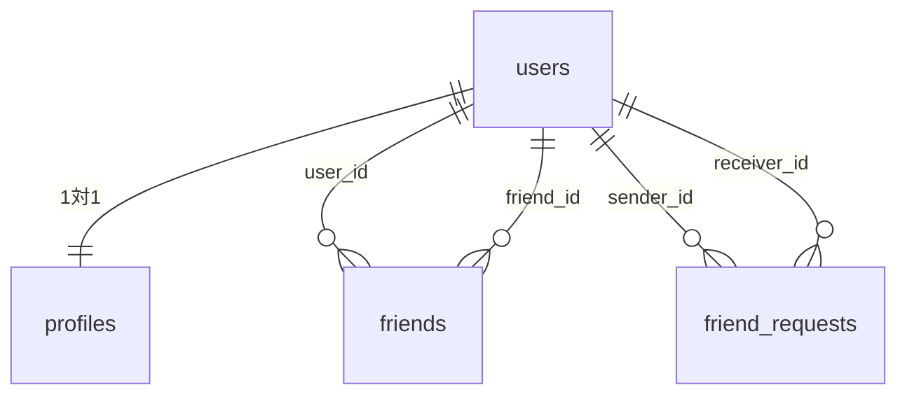
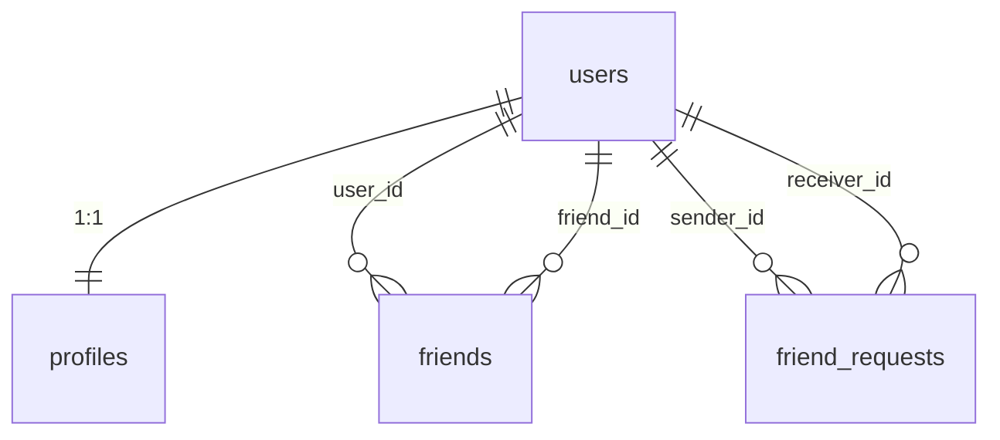

# ft_transcendence

42 Tokyo — フルスタック Web アプリケーション（Pong ゲーム + ユーザー管理 + チャット）

---

## チーム情報

| ハンドル | GitHub                                                 |
| -------- | ------------------------------------------------------ |
| sishizaw | [@shinji-japaaaan](https://github.com/shinji-japaaaan) |
| alex     | [@alex216](https://github.com/alex216)                 |
| tenpapa  | [@tenpapa1988](https://github.com/tenpapa1988)         |
| Federico | [@fceragio](https://github.com/fceragio)               |

---

## 役割分担

| メンバー    | 主な担当                                                                                                         |
| ----------- | ---------------------------------------------------------------------------------------------------------------- |
| sishizaw    | DB 設計・マイグレーション管理、バックエンド API（Profile / Stats / GDPR）、セキュリティ修正（Path Injection 等） |
| alex (yliu) | ゲームバックエンド（WebSocket / AI モード / オンライン対戦）、Docker・CI 整備、統合テスト、PR 管理               |
| tenpapa     | フロントエンド全般（UI / UX、レスポンシブ対応、i18n 多言語化、統計・履歴ページ）                                 |
| Federico    | ゲームロジック（再接続処理・AI 難易度調整・切断判定）、shared 定数・DTO 設計                                     |

---

## 機能リスト

### 認証・アカウント

- ユーザー名 / パスワードによる新規登録・ログイン
- 42 OAuth 連携ログイン（42 API 経由）
- JWT 認証（HTTP Only Cookie）
- 二要素認証（2FA）— Google Authenticator 対応
- CSRF 保護（Double Submit Cookie）

### ユーザー・プロフィール

- 表示名・自己紹介・アバター画像の編集
- フレンド申請 / 承認 / 一覧表示

### Pong ゲーム

- AI 対戦モード（難易度調整可能）
- オンライン対戦モード（WebSocket リアルタイム通信）
- ゲーム中のモード切替時確認ダイアログ
- 再接続処理（相手切断後の自動判定）
- スコア保存・試合履歴

### 統計・ランキング

- 勝率 / 勝敗数 / 試合数のダッシュボード
- 直近の試合履歴一覧
- リーダーボード（全ユーザーランキング）

### チャット

- グローバルチャット（全員参加のルーム）
- WebSocket によるリアルタイムメッセージ

### GDPR 対応

- 個人データのエクスポート（JSON ダウンロード）
- アカウント削除（全関連データの消去）

### その他

- 多言語対応 UI（日本語 / 英語 / フランス語）
- レスポンシブデザイン（PC / タブレット / モバイル）
- HTTPS 通信（Nginx + 自己署名証明書）

---

## 技術スタック

| 層               | 技術                                              | 補足                                  |
| ---------------- | ------------------------------------------------- | ------------------------------------- |
| フロントエンド   | React 18 + TypeScript + Vite                      | SPA 構成                              |
| バックエンド     | NestJS (TypeScript)                               | モジュール分割、Guard / Pipe パターン |
| データベース     | PostgreSQL 15                                     | TypeORM によるスキーマ管理            |
| リアルタイム通信 | WebSocket（Socket.IO）                            | ゲーム・チャット                      |
| 認証             | JWT (Passport.js) + Google Authenticator 対応 2FA | Cookie ベース                         |
| リバースプロキシ | Nginx                                             | HTTPS 終端・ルーティング              |
| 秘密情報管理     | HashiCorp Vault                                   | 開発環境では dev モード               |
| コンテナ         | Docker + Docker Compose                           | 全サービス一括管理                    |

---

## モジュール一覧と選定理由

### バックエンド（NestJS）

| モジュール      | パス                   | 説明                                      |
| --------------- | ---------------------- | ----------------------------------------- |
| `AuthModule`    | `backend/src/auth/`    | JWT 発行・検証、2FA、42 OAuth、CSRF       |
| `UserModule`    | `backend/src/user/`    | ユーザーエンティティ管理                  |
| `ProfileModule` | `backend/src/profile/` | プロフィール CRUD（表示名・アバター等）   |
| `FriendModule`  | `backend/src/friend/`  | フレンド申請・承認・一覧                  |
| `ChatModule`    | `backend/src/chat/`    | WebSocket ゲートウェイ + メッセージ永続化 |
| `GameModule`    | `backend/src/game/`    | Pong ゲームロジック・AI・試合履歴         |
| `StatsModule`   | `backend/src/stats/`   | 勝率・試合数の集計 API                    |
| `GdprModule`    | `backend/src/gdpr/`    | データエクスポート・アカウント削除        |

**NestJS を採用した理由**: TypeScript ネイティブで型安全性が高く、認証チェック（Guard）・入力バリデーション（Pipe）・ルーティング（Decorator）を各モジュールから独立して定義できるため。

### フロントエンド（React + Vite）

| ディレクトリ               | 内容                                                     |
| -------------------------- | -------------------------------------------------------- |
| `frontend/src/components/` | 各ページコンポーネント（Game / Chat / Profile 等）       |
| `frontend/src/hooks/`      | カスタムフック（CSRF トークン取得、GDPR 操作、統計取得） |
| `frontend/src/services/`   | WebSocket クライアント（ゲーム・チャット）               |
| `frontend/src/i18n/`       | 多言語翻訳テーブル                                       |

### インフラ

| ファイル                  | 役割                                                              |
| ------------------------- | ----------------------------------------------------------------- |
| `docker-compose.yml`      | 5 サービス（nginx / vault / postgres / backend / frontend）の定義 |
| `nginx/nginx.conf`        | HTTPS 終端・`/api` → バックエンドへのリバースプロキシ             |
| `Makefile`                | `make setup` / `make build` など開発用コマンドの集約              |
| `backend/src/migrations/` | TypeORM マイグレーションファイル                                  |
| `shared/`                 | フロントエンド・バックエンド共通の型定義・定数                    |

---

## データベーススキーマ

詳細は [`docs/er-diagram.md`](./docs/er-diagram.md) を参照してください。

| テーブル          | 説明                                                             |
| ----------------- | ---------------------------------------------------------------- |
| `users`           | 認証情報（username, password hash, 42 ID, 2FA 設定）             |
| `profiles`        | プロフィール情報（displayName, bio, avatarUrl）— users と 1 対 1 |
| `friends`         | 承認済みフレンド関係                                             |
| `friend_requests` | フレンド申請（pending / accepted / rejected）                    |
| `chat`            | チャットメッセージ（roomId 単位）                                |
| `match_history`   | 対戦履歴（winnerUserId, loserUserId, スコア）                    |



---

## 個人の貢献内容

### sishizaw

- **DB 設計**: ER 図作成・TypeORM エンティティ定義・マイグレーション整備
- **バックエンド API**: `ProfileModule`（プロフィール CRUD）・`StatsModule`（統計集計）・`GdprModule`（データ削除 / エクスポート）
- **セキュリティ**: CodeQL 指摘の Path Injection 修正、2FA 関連バグ修正

### alex (yliu)

- **ゲームバックエンド**: WebSocket ゲートウェイ、AI モード、オンライン対戦キューイング
- **ゲームフロントエンド**: `GamePage` 新プロトコル対応（降参・再接続・モード切替）
- **インフラ**: Docker Compose 設定・Nginx・HashiCorp Vault 統合
- **品質**: 統合テストスイート追加、TypeORM マイグレーション自動実行、dependabot 管理

### tenpapa

- **フロントエンド**: レスポンシブ対応（モバイル・タブレット・PC）
- **UI/UX**: Bootstrap 移行、ハンバーガーナビゲーション、ホームページ UI
- **多言語化**: 日 / 英 / 仏 の i18n 翻訳テーブル
- **統計ページ**: `HistoryPage`・`LeaderboardPage` をバックエンド API に接続

### Federico

- **ゲームロジック**: AI 難易度調整（人間らしい動作）、再接続処理（バックエンド自動判定）
- **切断判定**: 両プレイヤー切断時の試合無効化、相手切断後の降参処理
- **shared 設計**: `GRACE_TIME` 等の共通定数・DTO を `shared/` に分離

---

## セットアップ手順

### 前提条件

- Docker および Docker Compose がインストールされていること
- Node.js（husky / lint-staged のセットアップに必要）

### 42 OAuth を使う場合

42 Intra の Application 管理画面でアプリを登録し、
Redirect URI に `https://localhost/api/auth/42/callback` を設定します。

### 手順

```bash
# 1. リポジトリをクローン
git clone git@github.com:alex216/ft_transcendence.git
cd ft_transcendence

# 2. 初回セットアップ
#    - .env の生成（CSRF_SECRET / JWT_SECRET を自動生成）
#    - SSL 証明書の生成（nginx/ssl/）
#    - npm install（husky / lint-staged の有効化）
make setup

# 3. .env を編集（42 OAuth を使う場合）
#    FORTY_TWO_CLIENT_ID / FORTY_TWO_CLIENT_SECRET を設定
nano .env

# 4. コンテナをビルドして起動
make build

# 5. ブラウザでアクセス
#    https://localhost
#    ※ 自己署名証明書のため、ブラウザの警告を「詳細設定」→「続行」で進む
```

### コマンド一覧

| コマンド         | 説明                                                   |
| ---------------- | ------------------------------------------------------ |
| `make setup`     | 初回セットアップ（.env 生成・SSL 証明書・npm install） |
| `make build`     | コンテナを再ビルドして起動                             |
| `make up`        | コンテナを起動（ビルドなし）                           |
| `make down`      | コンテナを停止                                         |
| `make logs`      | 全サービスのログを表示                                 |
| `make reinstall` | node_modules を再インストールして再起動                |
| `make fclean`    | コンテナ・ボリュームを完全削除                         |
| `make re`        | fclean + build                                         |

### アクセス先

起動後、ブラウザで `https://localhost` にアクセスしてください。

> 自己署名証明書のため「接続が安全ではありません」と表示されます。「詳細設定」→「localhost にアクセスする（安全でない）」で続行できます。

---

## API 仕様

### 認証

| エンドポイント      | メソッド | 説明                              |
| ------------------- | -------- | --------------------------------- |
| `/auth/csrf-token`  | GET      | CSRF トークンの取得               |
| `/auth/register`    | POST     | ユーザー登録                      |
| `/auth/login`       | POST     | ログイン（JWT Cookie 発行）       |
| `/auth/logout`      | POST     | ログアウト（Cookie 削除）         |
| `/auth/me`          | GET      | ログイン中のユーザー情報取得      |
| `/auth/42`          | GET      | 42 OAuth ログイン開始             |
| `/auth/42/callback` | GET      | 42 OAuth コールバック             |
| `/auth/2fa/setup`   | GET      | 2FA セットアップ（QR コード取得） |
| `/auth/2fa/verify`  | POST     | 2FA コード検証                    |
| `/auth/2fa/disable` | POST     | 2FA 無効化                        |

### プロフィール・フレンド・統計

| エンドポイント           | メソッド    | 説明                         |
| ------------------------ | ----------- | ---------------------------- |
| `/profile/me`            | GET / PATCH | 自プロフィール取得・更新     |
| `/profile/:id`           | GET         | 他ユーザーのプロフィール取得 |
| `/profile/avatar`        | POST        | アバター画像アップロード     |
| `/friend`                | GET         | フレンド一覧                 |
| `/friend/requests`       | GET         | フレンド申請一覧             |
| `/friend/request/:id`    | POST        | フレンド申請送信             |
| `/friend/accept/:id`     | POST        | フレンド申請承認             |
| `/stats/:userId`         | GET         | ユーザー統計（勝率・試合数） |
| `/stats/history/:userId` | GET         | 試合履歴一覧                 |
| `/stats/leaderboard`     | GET         | リーダーボード               |

### GDPR

| エンドポイント | メソッド | 説明                             |
| -------------- | -------- | -------------------------------- |
| `/gdpr/export` | GET      | 個人データを JSON でエクスポート |
| `/gdpr/delete` | DELETE   | アカウントと全関連データを削除   |

---

## 環境変数

| 変数名                    | 説明                                             | デフォルト                               |
| ------------------------- | ------------------------------------------------ | ---------------------------------------- |
| `POSTGRES_USER`           | DB ユーザー名                                    | `transcendence`                          |
| `POSTGRES_PASSWORD`       | DB パスワード                                    | —                                        |
| `POSTGRES_DB`             | DB 名                                            | `transcendence_db`                       |
| `POSTGRES_HOST`           | DB ホスト（Docker 内）                           | `postgres`                               |
| `POSTGRES_PORT`           | DB ポート                                        | `5432`                                   |
| `CSRF_SECRET`             | CSRF トークン署名キー（`make setup` で自動生成） | —                                        |
| `JWT_SECRET`              | JWT 署名キー（`make setup` で自動生成）          | —                                        |
| `BACKEND_PORT`            | バックエンドのポート                             | `3000`                                   |
| `FRONTEND_PORT`           | フロントエンドのポート                           | `3001`                                   |
| `NODE_ENV`                | 実行環境                                         | `development`                            |
| `FRONTEND_URL`            | フロントエンド URL（CORS 用）                    | `https://localhost`                      |
| `VITE_API_URL`            | バックエンド API URL（フロントエンド用）         | `https://localhost/api`                  |
| `FORTY_TWO_CLIENT_ID`     | 42 OAuth クライアント ID                         | —                                        |
| `FORTY_TWO_CLIENT_SECRET` | 42 OAuth クライアントシークレット                | —                                        |
| `FORTY_TWO_CALLBACK_URL`  | 42 OAuth コールバック URL                        | `https://localhost/api/auth/42/callback` |
| `VAULT_ADDR`              | Vault アドレス                                   | `http://vault:8200`                      |
| `VAULT_TOKEN`             | Vault トークン                                   | —                                        |

---

## トラブルシューティング

### ブラウザに「接続が安全ではありません」と表示される

開発用の自己署名証明書を使用しているため正常な動作です。
「詳細設定」→「localhost にアクセスする（安全でない）」を選択して続行してください。

### コンテナが起動しない

```bash
make logs
docker-compose ps
```

### データベース接続エラー

```bash
docker-compose logs postgres
docker-compose down -v
make build
```

### npm install エラー

```bash
make reinstall
```

### ポートが使用中

```bash
lsof -i :443   # Nginx
lsof -i :3000  # バックエンド
lsof -i :3001  # フロントエンド
lsof -i :5432  # PostgreSQL
```

---

## セキュリティについて

| 対策                     | 実装方法                                                      |
| ------------------------ | ------------------------------------------------------------- |
| XSS 対策                 | JWT を HTTP Only Cookie で管理（JavaScript からアクセス不可） |
| CSRF 対策                | Double Submit Cookie パターン                                 |
| SQL インジェクション対策 | TypeORM のパラメータバインディング                            |
| パスワード保護           | bcrypt によるハッシュ化                                       |
| HTTPS                    | Nginx による TLS 終端                                         |
| 二要素認証               | Google Authenticator 対応（TOTP）                             |
| 入力バリデーション       | NestJS DTO + class-validator                                  |

---

---

# ft_transcendence (English)

42 Tokyo — Full-stack web application (Pong game + user management + chat)

---

## Team Information

| Handle   | GitHub                                                 |
| -------- | ------------------------------------------------------ |
| sishizaw | [@shinji-japaaaan](https://github.com/shinji-japaaaan) |
| alex     | [@alex216](https://github.com/alex216)                 |
| tenpapa  | [@tenpapa1988](https://github.com/tenpapa1988)         |
| Federico | [@fceragio](https://github.com/fceragio)               |

---

## Roles

| Member      | Main responsibilities                                                                                         |
| ----------- | ------------------------------------------------------------------------------------------------------------- |
| sishizaw    | DB design & migration management, backend API (Profile / Stats / GDPR), security fixes (Path Injection, etc.) |
| alex (yliu) | Game backend (WebSocket / AI mode / online play), Docker & CI setup, integration tests, PR management         |
| tenpapa     | Frontend (UI/UX, responsive design, i18n, stats & history pages)                                              |
| Federico    | Game logic (reconnection, AI difficulty, disconnect handling), shared constants & DTO design                  |

---

## Features

### Authentication & Account

- User registration and login with username / password
- 42 OAuth login (via 42 API)
- JWT authentication (HTTP Only Cookie)
- Two-factor authentication (2FA) — Google Authenticator compatible
- CSRF protection (Double Submit Cookie)

### User & Profile

- Edit display name, bio, and avatar image
- Friend requests / approval / list

### Pong Game

- AI match mode (adjustable difficulty)
- Online match mode (WebSocket real-time)
- Confirmation dialog when switching modes mid-game
- Reconnection handling (auto-detection after opponent disconnects)
- Score saving and match history

### Statistics & Rankings

- Dashboard showing win rate / win-loss count / total matches
- Recent match history list
- Leaderboard (ranking of all users)

### Chat

- Global chat room (open to all users)
- Real-time messages via WebSocket

### GDPR

- Personal data export (JSON download)
- Account deletion (removes all associated data)

### Other

- Multilingual UI (Japanese / English / French)
- Responsive design (PC / tablet / mobile)
- HTTPS (Nginx + self-signed certificate)

---

## Technical Stack

| Layer             | Technology                                              | Notes                                |
| ----------------- | ------------------------------------------------------- | ------------------------------------ |
| Frontend          | React 18 + TypeScript + Vite                            | SPA architecture                     |
| Backend           | NestJS (TypeScript)                                     | Modular design, Guard / Pipe pattern |
| Database          | PostgreSQL 15                                           | Schema managed by TypeORM            |
| Real-time         | WebSocket (Socket.IO)                                   | Game and chat                        |
| Auth              | JWT (Passport.js) + Google Authenticator compatible 2FA | Cookie-based                         |
| Reverse proxy     | Nginx                                                   | HTTPS termination and routing        |
| Secret management | HashiCorp Vault                                         | Dev mode in development environment  |
| Containerization  | Docker + Docker Compose                                 | All services managed together        |

---

## Module List and Rationale

### Backend (NestJS)

| Module          | Path                   | Description                                 |
| --------------- | ---------------------- | ------------------------------------------- |
| `AuthModule`    | `backend/src/auth/`    | JWT issue/verification, 2FA, 42 OAuth, CSRF |
| `UserModule`    | `backend/src/user/`    | User entity management                      |
| `ProfileModule` | `backend/src/profile/` | Profile CRUD (display name, avatar, etc.)   |
| `FriendModule`  | `backend/src/friend/`  | Friend requests, approval, list             |
| `ChatModule`    | `backend/src/chat/`    | WebSocket gateway + message persistence     |
| `GameModule`    | `backend/src/game/`    | Pong game logic, AI, match history          |
| `StatsModule`   | `backend/src/stats/`   | Win rate and match count aggregation API    |
| `GdprModule`    | `backend/src/gdpr/`    | Data export and account deletion            |

**Why NestJS**: TypeScript-native with strong type safety. Authentication checks (Guard), input validation (Pipe), and routing (Decorator) can each be defined independently from business logic modules.

### Frontend (React + Vite)

| Directory                  | Contents                                                   |
| -------------------------- | ---------------------------------------------------------- |
| `frontend/src/components/` | Page components (Game / Chat / Profile, etc.)              |
| `frontend/src/hooks/`      | Custom hooks (CSRF token fetch, GDPR actions, stats fetch) |
| `frontend/src/services/`   | WebSocket clients (game and chat)                          |
| `frontend/src/i18n/`       | Multilingual translation tables                            |

### Infrastructure

| File                      | Role                                                               |
| ------------------------- | ------------------------------------------------------------------ |
| `docker-compose.yml`      | Defines 5 services (nginx / vault / postgres / backend / frontend) |
| `nginx/nginx.conf`        | HTTPS termination and `/api` → backend reverse proxy               |
| `Makefile`                | Aggregates dev commands: `make setup`, `make build`, etc.          |
| `backend/src/migrations/` | TypeORM migration files                                            |
| `shared/`                 | Type definitions and constants shared between frontend and backend |

---

## Database Schema

See [`docs/er-diagram.md`](./docs/er-diagram.md) for the full ER diagram and constraints.

| Table             | Description                                                 |
| ----------------- | ----------------------------------------------------------- |
| `users`           | Auth info (username, password hash, 42 ID, 2FA settings)    |
| `profiles`        | Profile info (displayName, bio, avatarUrl) — 1:1 with users |
| `friends`         | Confirmed friend relationships                              |
| `friend_requests` | Friend requests (pending / accepted / rejected)             |
| `chat`            | Chat messages (per roomId)                                  |
| `match_history`   | Match results (winnerUserId, loserUserId, scores)           |



---

## Individual Contributions

### sishizaw

- **DB design**: ER diagram, TypeORM entity definitions, migration setup
- **Backend API**: `ProfileModule` (profile CRUD), `StatsModule` (stats aggregation), `GdprModule` (data deletion / export)
- **Security**: Fixed CodeQL-reported Path Injection vulnerability; fixed 2FA-related bugs

### alex (yliu)

- **Game backend**: WebSocket gateway, AI mode, online matchmaking queue
- **Game frontend**: Updated `GamePage` for new protocol (forfeit, reconnect, mode switch)
- **Infrastructure**: Docker Compose, Nginx, HashiCorp Vault integration
- **Quality**: Added integration test suite, TypeORM migration auto-run, dependabot management

### tenpapa

- **Frontend**: Responsive design (mobile / tablet / PC)
- **UI/UX**: Bootstrap migration, hamburger navigation, home page UI
- **Internationalization**: Japanese / English / French translation tables
- **Stats pages**: Connected `HistoryPage` and `LeaderboardPage` to backend API

### Federico

- **Game logic**: AI difficulty tuning (human-like behavior), reconnection handling (auto-detection on backend)
- **Disconnect handling**: Match invalidation when both players disconnect; forfeit handling after opponent disconnect
- **Shared design**: Extracted common constants (`GRACE_TIME`, etc.) and DTOs into `shared/`

---

## Setup Instructions

### Prerequisites

- Docker and Docker Compose must be installed
- Node.js (required for husky / lint-staged setup)

### For 42 OAuth

Register an application on 42 Intra Application settings and set the Redirect URI to `https://localhost/api/auth/42/callback`.

### Steps

```bash
# 1. Clone the repository
git clone git@github.com:alex216/ft_transcendence.git
cd ft_transcendence

# 2. First-time setup
#    - Generate .env (auto-generates CSRF_SECRET / JWT_SECRET)
#    - Generate SSL certificate (nginx/ssl/)
#    - npm install (enables husky / lint-staged)
make setup

# 3. Edit .env if using 42 OAuth
#    Set FORTY_TWO_CLIENT_ID and FORTY_TWO_CLIENT_SECRET
nano .env

# 4. Build and start containers
make build

# 5. Access in browser
#    https://localhost
#    * Due to self-signed certificate, click "Advanced" → "Proceed to localhost"
```

### Commands

| Command          | Description                                             |
| ---------------- | ------------------------------------------------------- |
| `make setup`     | First-time setup (generate .env, SSL cert, npm install) |
| `make build`     | Rebuild and start containers                            |
| `make up`        | Start containers (no rebuild)                           |
| `make down`      | Stop containers                                         |
| `make logs`      | Stream logs from all services                           |
| `make reinstall` | Reinstall node_modules and restart                      |
| `make fclean`    | Remove all containers and volumes                       |
| `make re`        | fclean + build                                          |

### Access

After startup, open `https://localhost` in your browser.

> The browser will show a certificate warning because a self-signed certificate is used. Click "Advanced" → "Proceed to localhost (unsafe)" to continue.

---

## API Reference

### Authentication

| Endpoint            | Method | Description               |
| ------------------- | ------ | ------------------------- |
| `/auth/csrf-token`  | GET    | Get CSRF token            |
| `/auth/register`    | POST   | Register a new user       |
| `/auth/login`       | POST   | Login (issues JWT cookie) |
| `/auth/logout`      | POST   | Logout (clears cookie)    |
| `/auth/me`          | GET    | Get current user info     |
| `/auth/42`          | GET    | Start 42 OAuth login      |
| `/auth/42/callback` | GET    | 42 OAuth callback         |
| `/auth/2fa/setup`   | GET    | 2FA setup (get QR code)   |
| `/auth/2fa/verify`  | POST   | Verify 2FA code           |
| `/auth/2fa/disable` | POST   | Disable 2FA               |

### Profile, Friends & Stats

| Endpoint                 | Method      | Description                        |
| ------------------------ | ----------- | ---------------------------------- |
| `/profile/me`            | GET / PATCH | Get or update own profile          |
| `/profile/:id`           | GET         | Get another user's profile         |
| `/profile/avatar`        | POST        | Upload avatar image                |
| `/friend`                | GET         | Friend list                        |
| `/friend/requests`       | GET         | Friend request list                |
| `/friend/request/:id`    | POST        | Send friend request                |
| `/friend/accept/:id`     | POST        | Accept friend request              |
| `/stats/:userId`         | GET         | User stats (win rate, match count) |
| `/stats/history/:userId` | GET         | Match history list                 |
| `/stats/leaderboard`     | GET         | Leaderboard                        |

### GDPR

| Endpoint       | Method | Description                            |
| -------------- | ------ | -------------------------------------- |
| `/gdpr/export` | GET    | Export personal data as JSON           |
| `/gdpr/delete` | DELETE | Delete account and all associated data |

---

## Environment Variables

| Variable                  | Description                                             | Default                                  |
| ------------------------- | ------------------------------------------------------- | ---------------------------------------- |
| `POSTGRES_USER`           | DB username                                             | `transcendence`                          |
| `POSTGRES_PASSWORD`       | DB password                                             | —                                        |
| `POSTGRES_DB`             | DB name                                                 | `transcendence_db`                       |
| `POSTGRES_HOST`           | DB host (inside Docker)                                 | `postgres`                               |
| `POSTGRES_PORT`           | DB port                                                 | `5432`                                   |
| `CSRF_SECRET`             | CSRF token signing key (auto-generated by `make setup`) | —                                        |
| `JWT_SECRET`              | JWT signing key (auto-generated by `make setup`)        | —                                        |
| `BACKEND_PORT`            | Backend port                                            | `3000`                                   |
| `FRONTEND_PORT`           | Frontend port                                           | `3001`                                   |
| `NODE_ENV`                | Runtime environment                                     | `development`                            |
| `FRONTEND_URL`            | Frontend URL (for CORS)                                 | `https://localhost`                      |
| `VITE_API_URL`            | Backend API URL (for frontend)                          | `https://localhost/api`                  |
| `FORTY_TWO_CLIENT_ID`     | 42 OAuth client ID                                      | —                                        |
| `FORTY_TWO_CLIENT_SECRET` | 42 OAuth client secret                                  | —                                        |
| `FORTY_TWO_CALLBACK_URL`  | 42 OAuth callback URL                                   | `https://localhost/api/auth/42/callback` |
| `VAULT_ADDR`              | Vault address                                           | `http://vault:8200`                      |
| `VAULT_TOKEN`             | Vault token                                             | —                                        |

---

## Troubleshooting

### Browser shows "Your connection is not private"

This is expected behavior because a self-signed certificate is used for development.
Click "Advanced" → "Proceed to localhost (unsafe)" to continue.

### Containers fail to start

```bash
make logs
docker-compose ps
```

### Database connection error

```bash
docker-compose logs postgres
docker-compose down -v
make build
```

### npm install error

```bash
make reinstall
```

### Port already in use

```bash
lsof -i :443   # Nginx
lsof -i :3000  # Backend
lsof -i :3001  # Frontend
lsof -i :5432  # PostgreSQL
```

---

## Security

| Measure                  | Implementation                                                  |
| ------------------------ | --------------------------------------------------------------- |
| XSS protection           | JWT stored in HTTP Only Cookie (not accessible from JavaScript) |
| CSRF protection          | Double Submit Cookie pattern                                    |
| SQL injection protection | TypeORM parameter binding                                       |
| Password protection      | Hashed with bcrypt                                              |
| HTTPS                    | TLS termination via Nginx                                       |
| Two-factor auth          | Google Authenticator compatible (TOTP)                          |
| Input validation         | NestJS DTO + class-validator                                    |
