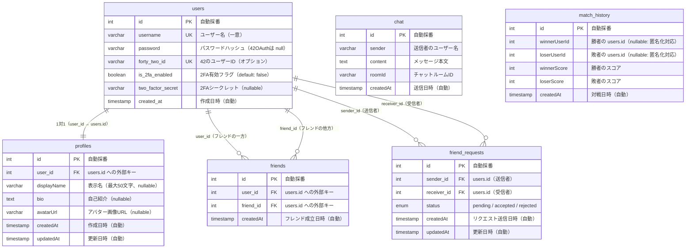

# ER図（ft_transcendence データベース設計）

## テーブル一覧

| テーブル名        | 対応 Entity     | 説明                              |
| ----------------- | --------------- | --------------------------------- |
| `users`           | `User`          | 認証情報・アカウント              |
| `profiles`        | `Profile`       | プロフィール情報（users と 1対1） |
| `friends`         | `Friend`        | フレンド関係（承認済み）          |
| `friend_requests` | `FriendRequest` | フレンドリクエスト（申請中）      |
| `chat`            | `Chat`          | チャットメッセージ                |
| `match_history`   | `MatchHistory`  | 対戦履歴                          |

## ER図

## リレーション説明

| リレーション                | 種類           | 説明                                                                                                                     |
| --------------------------- | -------------- | ------------------------------------------------------------------------------------------------------------------------ |
| `users` ↔ `profiles`        | 1対1           | 1ユーザーに1プロフィール。ユーザー削除時にCASCADE                                                                        |
| `users` ↔ `friends`         | 1対多（2経路） | `user_id` と `friend_id` の両方が `users` を参照。`(user_id, friend_id)` のペアはUNIQUE制約あり                          |
| `users` ↔ `friend_requests` | 1対多（2経路） | `sender_id`（送信者）と `receiver_id`（受信者）が `users` を参照                                                         |
| `chat`                      | 独立           | `sender` は `users.username` を文字列で保持（FK なし）。ユーザー削除時も履歴を保持                                       |
| `match_history`             | 独立（疑似FK） | `winnerUserId`/`loserUserId` は `users.id` を参照するが、FK制約なし。削除済みユーザーの試合履歴を保持するため `nullable` |

## 制約一覧

| テーブル          | 制約           | 対象列                                      |
| ----------------- | -------------- | ------------------------------------------- |
| `users`           | UNIQUE         | `username`                                  |
| `users`           | UNIQUE         | `forty_two_id`                              |
| `profiles`        | UNIQUE（暗黙） | `user_id`（OneToOneのため）                 |
| `friends`         | UNIQUE         | `(user_id, friend_id)`                      |
| `friend_requests` | ENUM           | `status`: `pending`, `accepted`, `rejected` |
